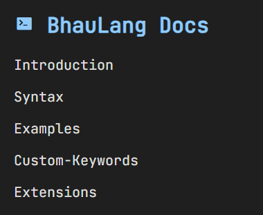

<h1 align="center">Bhau Lang</h1>
<div align="center">

</div>
<br>

## Table of Contents

- [Table of Contents](#table-of-contents)
- [Limitations](#limitations)
- [Installation](#installation)
- [Build project](#build-project)
- [Documentation](#documentation)
- [Development](#development)
- [Extensions](#extensions)
- [Roadmap](#roadmap)
- [Contributing](#contributing)
- [License](#license)
- [Contact](#contact)

## Limitations

- Only supports Linux (x86_64)
- No support for:
  - Postfix operators (`x++`)
  - Nested function calls (`func1(x, func2())`)
  - Ternary operators (`1 == 1 ? x : y`)


## Installation

To install the project, run :

```
chmod +x build.sh
```

To start the installation and setup process, run :

```
./build.sh
```

You will receive the following message, `Welcome to BhauLang!` in your terminal.
Since the script updates your shell's config file, you need to run :

```
source [path to your config file] 
```

Create a new `test.bl` :

```
hi bhau

bhau baherun ghe printf bol;

bhau ithun chalu {
    bol("Hello from BhauLang!");
}

bye bhau
```

Run :

```
blc test.bl
./test
```
The output should be :

```
Hello from BhauLang!
```

Congrats! You are now ready to use BhauLang!

## Build project

To build the project manually, make sure that you have gcc, nasm and make installed already. Run:

```
make 
```

Add path to your config file for the ELF-64 executable in `application` :

```
export PATH="[path to BhauLang folder]/application"
```

Source your config file. 

Refer to [Installation](#installation) section above to set up and test your first BhauLang program.

## Documentation

To view the documentation, start a web server in current directory and migrate to `docs/bl_doc.html`. The following sections are explained in the documentation :

<br>
<div align="center">

</div>
<br>

## Development

Every building block of BhauLang, the lexer, parser, IR generator and code generator are modular header only libraries, each module is customizable and can be reused to build your own programming language. The modules in `src/common` folder are standalone helper files.

Examples for BhauLang are given in `examples` folder, along with the output of each block of BhauLang compiler. 


## Extensions

The VS code extension package is available at : `extras/extensions/vsix` . Right click on the extension and click on `Install extension VSIX`

## Roadmap

- [ ] Windows support
- [ ] BhauLang Playground (web-based)

## Contributing

Pull requests are welcome. For major changes, please open an issue first to discuss what you'd like to change.

Please make sure to update tests as appropriate.

## License

This project is licensed under the GNU 3.0 General Public License. See the [LICENSE](./LICENSE) file for details.

## Contact

Created and maintained by [Akshay Kulkarni](https://github.com/AkshayKulkarni3467)  
Feel free to reach out for collaborations or feature requests.
